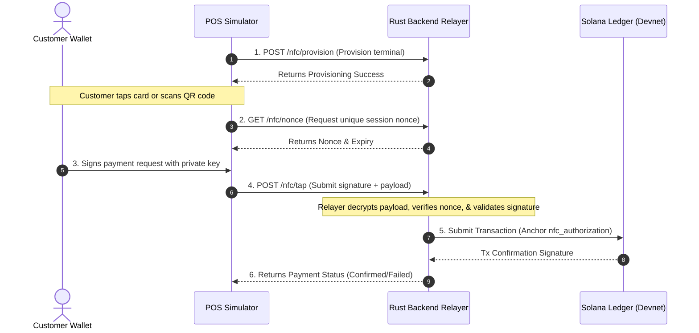
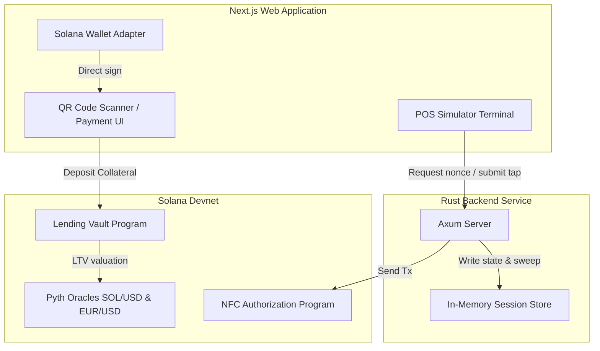

# Digital Payment System

A revolutionary digital payment system that lets you spend your crypto without selling it. Built on Solana with Anchor smart contracts, it enables credit-mode spending using SOL as collateral, real-time Pyth oracle risk calculations, and hybrid cryptographic NFC tap payments.

---

## 🚀 Features

### Core Functionality
- **Credit & Debit Mode**: Use SOL as collateral to fund a credit line in EURC/USDC or spend directly.
- **Pyth Oracle Integration**: Real-time asset valuation (SOL/USD and EUR/USD) to dynamically calculate account loan-to-value (LTV) ratios and health factors.
- **Contactless NFC/QR Payments**: Integrated Web-NFC interfaces and fallback mock simulations for processing payments at a merchant terminal.
- **DeFi Swaps**: Best-rate swaps powered by the Jupiter DEX aggregator.

### Engineering Highlights
- **Unified Monorepo**: Built using npm workspaces for deterministic dependency resolution and workspace-aware executions.
- **Global Security Overrides**: Advanced version overrides at the root `package.json` to mitigate critical vulnerabilities (`postcss`, `sharp`) while preserving Solana v1 ecosystem libraries.
- **Rust Axum Backend Relayer**: High-performance Rust Axum service managing secure session nonces and broadcasting verified transactions.
- **Automated Keep-Alive Oracle**: GitHub Actions workflow updating Pyth price feed mock accounts on devnet.

---

## 🛠 Tech Stack

### Frontend & Apps
- **Next.js 16 (Turbopack)** — React Framework with App Router
- **TypeScript** — Strongly typed application logic
- **Vanilla CSS** — Custom styling tokens

### Backend Service
- **Rust (Axum)** — Lightweight, high-concurrency web framework
- **Anchor Client** — Program interaction client

### Smart Contracts (Solana Devnet)
- **Anchor Framework** — Smart contract lifecycle management
- **Programs**:
  - `programs/lending_vault`: Handles collateral locks, borrows, and liquidations.
  - `programs/nfc_authorization`: Manages registered POS devices and tap authorizations.

---

## 📂 Project Architecture

```
digital_payment_system/
├── apps/
│   └── web/                   # Next.js Frontend
│       ├── src/
│       │   ├── app/           # App router pages (dashboard, card, pos-simulator, qr-pay)
│       │   ├── components/    # Reusable UI components
│       │   ├── hooks/         # React hooks (useHealthFactor, useCardBalance)
│       │   └── lib/           # Unified libraries (web-nfc, anchor-client, pyth-feeds)
│       ├── package.json
│       └── next.config.ts
├── backend/                   # Rust Axum Web Service
│   ├── src/
│   │   ├── main.rs            # Entry point & Axum router
│   │   ├── handlers/          # NFC, Card, and Auth route handlers
│   │   └── state/             # Nonce and token stores
│   └── Cargo.toml
├── programs/                  # On-Chain Anchor Programs
│   ├── lending_vault/
│   └── nfc_authorization/
├── .github/workflows/         # CI/CD Workflows
├── package.json               # Monorepo Workspaces & Overrides
└── README.md
```

---

## 🏗 Data Flow & Architecture

### 1. Hybrid NFC Payment Sequence


### 2. On-Chain Component Architecture


---

## 🚀 Getting Started

### 📋 Prerequisites
- **Node.js**: `24`
- **Rust**: `stable` (via `rustup`)
- **Solana CLI**: `1.18+`
- **Anchor CLI**: `0.29+`

### 1. Setup & Installation
Clone the repository and install the workspace dependencies from the root directory:
```bash
# Clean install monorepo dependencies
npm ci
```

### 2. Run the Next.js Frontend
```bash
# Navigate to the frontend directory
cd apps/web

# Start Next.js development server with Turbopack
npm run dev
```
*The app will be available locally at `http://localhost:3000`.*

### 3. Run the Rust Backend
```bash
# Navigate to the backend directory
cd backend

# Build and start the server
cargo run --release
```
*The server will start listening on `http://localhost:8080`.*

---

## 🌐 Deployments & Configuration

### Environment Variables (`apps/web/.env`)
Create an `.env` file inside `apps/web/` to define your deployment environment:
```env
NEXT_PUBLIC_LENDING_PROGRAM_ID=2oyU8LCEPCicz6AN2emJw2BTZe8eU73CU5AJGhAEpcZz
NEXT_PUBLIC_NFC_PROGRAM_ID=BLAybZY5URNEhMvNGjdvwPPVNpvz7MqeNXC9R4YdL6Wc
NEXT_PUBLIC_WSOL_MINT=So11111111111111111111111111111111111111112
NEXT_PUBLIC_SOLANA_RPC=https://api.devnet.solana.com
NEXT_PUBLIC_BACKEND_URL=https://digital-payment-system-qtco.onrender.com
NEXT_PUBLIC_APP_URL=https://digital-payment-system.vercel.app
NEXT_PUBLIC_APP_NAME=Digital Payment System
```

### Active Live URLs
- **Frontend (Vercel)**: `https://digital-payment-system.vercel.app`
- **Backend Relayer (Render)**: `https://digital-payment-system-qtco.onrender.com`

---

## ⚠️ Disclaimer
This codebase is an MVP created for demonstration and testing purposes. It is not audited or recommended for production use without further security audits.
