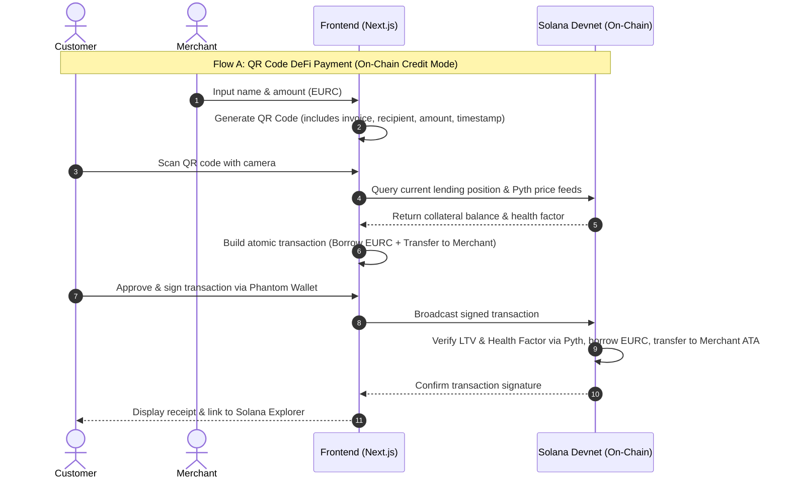
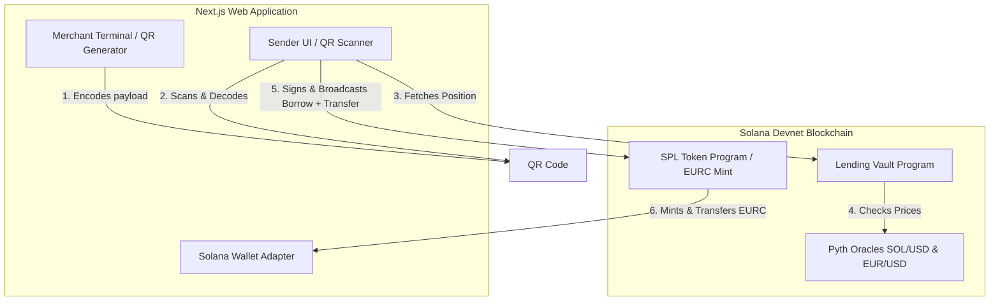

# Digital_payment_system


A revolutionary digital payment system that lets you spend your crypto without selling it. Built on Solana with Anchor smart contracts,  enables credit mode spending, 2% cashback rewards, and daily interest on collateral.

## 🚀 Features

### Core Functionality

- **Credit & Debit Mode**: Switch between direct crypto spending or using crypto as collateral for a credit line
- **2% Cashback Rewards**: Earn up to 2% cashback in crypto on every purchase in Credit Mode
- **Daily Interest**: Unspent collateral earns interest 24/7
- **Non-Custodial Security**: Your keys, your crypto — backed by Anchor smart contracts
- **Global Acceptance**: Accepted at 100M+ merchants worldwide with Apple Pay & Google Pay support
- **Instant Swaps**: Best-rate token swaps powered by Jupiter DEX aggregator

### Technical Highlights

- **Solana Integration**: High-speed, low-cost transactions
- **Real-time Liquidation Protection**: Automated risk management
- **Multi-token Support**: Deposit SOL and other supported tokens as collateral
- **POS Simulator**: Test card transactions in a simulated environment

## 🛠 Tech Stack

### Frontend

- **Next.js 16** - React framework with App Router
- **TypeScript** - Type-safe development
- **Tailwind CSS** - Utility-first styling
- **Radix UI** - Accessible component primitives
- **Lucide React** - Icon library

### Backend

- **Rust** - High-performance systems programming
- **Actix Web** (assumed) - Web framework for API services

### Blockchain

- **Solana** - High-performance blockchain
- **Anchor Framework** - Solana smart contract development
- **Jupiter** - DEX aggregator for token swaps

### Infrastructure

- **Docker** - Containerization
- **Kubernetes** - Orchestration
- **Terraform** - Infrastructure as Code

## 📋 Prerequisites

- Node.js 18+
- Rust 1.70+
- Solana CLI tools
- Anchor CLI
- Docker & Docker Compose

## 🚀 Getting Started

### 1. Clone the Repository

```bash
git clone https://github.com/sks006/cryptoBridger.git
cd cryptoBridger
```

### 2. Setup Web Application

```bash
cd apps/web
npm install
npm run dev
```

The web app will be available at `http://localhost:3000`

### 3. Setup Backend

```bash
cd backend
cargo build
cargo run
```

### 4. Setup Solana Program

```bash
cd programs/lending_vault
anchor build
anchor deploy
```

### 5. Environment Configuration

Create `.env.local` in `apps/web` with:

```
NEXT_PUBLIC_SOLANA_RPC_URL=https://api.mainnet-beta.solana.com
NEXT_PUBLIC_JUPITER_API_URL=https://quote-api.jup.ag/v4
```

## 📖 Usage

### For Users

1. Connect your Solana wallet
2. Deposit collateral (SOL or supported tokens)
3. Activate your virtual crypto to a flat Card
4. Start spending and earning rewards

### For Developers

- **Development**: `npm run dev` in web app
- **Building**: `npm run build`
- **Testing**: Run tests in respective directories
- **POS Simulation**: Visit `/pos-simulator` to test card transactions

## 🏗 Architecture

```
crypto-fiat-card-mvp/

├── apps/
│   ├── web/                          # Your existing Next.js frontend (kept mostly unchanged)
│   │   ├── src/
│   │   │   ├── app/
│   │   │   │   ├── lamyt.tsx
│   │   │   │   ├── page.tsx                  # landing + connect wallet
│   │   │   │   ├── dashboard/
│   │   │   │   │   ├── page.tsx
│   │   │   │   │   └── transactions.tsx
│   │   │   │   ├── card/
│   │   │   │   │   ├── page.tsx
│   │   │   │   │   └── topup.tsx
│   │   │   │   ├── swap/
│   │   │   │   │   └── simulate.tsx
│   │   │   │   ├── pos-simulator/
│   │   │   │   │   └── page.tsx
│   │   │   │   └── nfc/                      # NEW for web
│   │   │   │       └── tap/page.tsx          # Web NFC demo page
│   │   │   ├── components/
│   │   │   │   ├── WalletConnect.tsx
│   │   │   │   ├── HealthFactorMeter.tsx
│   │   │   │   ├── CardBalance.tsx
│   │   │   │   ├── NFCRingAnimation.tsx
│   │   │   │   └── NFCTapButton.tsx          # NEW: Simulate / Real Web NFC button
│   │   │   ├── lib/
│   │   │   │   ├── solana.ts
│   │   │   │   ├── jupiter.ts
│   │   │   │   ├── anchor-client.ts
│   │   │   │   ├── api-client.ts
│   │   │   │   └── nfc/
│   │   │   │       ├── web-nfc.ts            # Web NFC API
│   │   │   │       └── mock-nfc.ts           # Fallback simulation
│   │   │   └── hooks/
│   │   │       ├── useHealthFactor.ts
│   │   │       ├── useCardBalance.ts
│   │   │       └── useNFCTap.ts              # Unified hook (Web + Mock)
│   │   ├── public/
│   │   ├── next.config.js
│   │   ├── tailwind.config.ts
│   │   └── package.json
│   │
│   └── mobile/                              # ✦ NEW — simplified RN app
│       ├── src/
│       │   ├── app/
│       │   │   ├── index.tsx               # wallet connect entry
│       │   │   ├── dashboard/
│       │   │   │   └── screen.tsx
│       │   │   ├── card/
│       │   │   │   └── screen.tsx
│       │   │   └── nfc/
│       │   │       ├── TapScreen.tsx       # ✦ NFC tap UI (mock)
│       │   │       └── MockProvision.tsx   # ✦ simulated card-to-wallet flow
│       │   ├── components/
│       │   │   ├── WalletConnect.tsx
│       │   │   ├── CardBalance.tsx
│       │   │   └── NFCRingAnimation.tsx    # ✦ simple tap pulse
│       │   └── lib/
│       │       ├── solana.ts
│       │       ├── jupiter.ts
│       │       ├── anchor-client.ts
│       │       ├── api-client.ts
│       │       └── nfc/
│       │           ├── nfc-manager.ts      # ✦ react-native-nfc-manager wrapper
│       │           └── mock-hce.ts         # ✦ Android HCE stub (logs APDU)
│       ├── android/
│       │   └── app/src/main/
│       │       ├── AndroidManifest.xml     # ✦ NFC + HCE permissions
│       │       └── java/.../
│       │           └── HCEService.java     # ✦ stub HostApduService
│       ├── ios/
│       │   └── CryptoCardMVP/
│       │       └── Info.plist              # ✦ NFCReaderUsageDescription
│       ├── package.json
│       ├── metro.config.js
│       └── app.json
│
├── programs/
|   ├── lending-vault/                      Your existing fixed lending protocol —
|   │   ├── src/
|   │   │   ├── lib.rs
|   │   │   ├── instructions/
|   │   │   │   ├── deposit.rs
|   │   │   │   ├── withdraw.rs
|   │   │   │   ├── borrow.rs                  # reads Pyth price feed
|   │   │   │   ├── repay.rs
|   │   │   │   └── liquidate.rs               # reads Pyth price feed
|   │   │   ├── state/
|   │   │   │   ├── vault.rs                   # includes price_feed Pubkey
|   │   │   │   └── user_position.rs
|   │   │   └── error.rs
|   │   ├── Anchor.toml
|   │   └── Cargo.toml                         # + pyth-sdk-solana
│
├── backend/
│   ├── src/
│   │   ├── main.rs
│   │   ├── handlers/
│   │   │   ├── health.rs
│   │   │   ├── auth.rs
│   │   │   ├── card.rs
│   │   │   ├── swipe.rs
│   │   │   └── nfc.rs                      # ✦ NEW
│   │   │       # POST /nfc/tap  → mock JIT, returns receipt JSON
│   │   │       # POST /nfc/provision → returns mock token { pan_token, exp }
│   │   ├── solana/
│   │   │   ├── client.rs
│   │   │   ├── vault_ix.rs
│   │   │   └── jupiter_quote.rs
│   │   ├── state/
│   │   │   ├── memory_store.rs             # HashMap<UserId, Session>
│   │   │   └── nfc_store.rs                # ✦ HashMap<DeviceId, MockToken>
│   │   └── utils/
│   │       ├── ltv.rs
│   │       └── nfc_nonce.rs                # ✦ one-time nonce gen (in-memory)
│   ├── Cargo.toml
│   └── .env
│
├── docs/
│   └── whitepaper/
│       ├── MiCA_summary.md
│       └── nfc_flow_notes.md               # ✦ APDU tap → mock JIT diagram
│
├── scripts/
│   ├── deploy-program.sh
│   ├── seed-mock-users.sh
│   └── simulate-nfc-tap.sh                 # ✦ curl POST /nfc/tap shortcut
│
├── tests/
│   └── e2e/
│       ├── swipe.test.ts
│       └── nfc_tap.test.ts                 # ✦ Detox NFC mock tap test
│
├── HACKATHON_README.md
└── .gitignore
```


## 🔄 Data Flow Diagrams

The platform supports two core payment mechanisms:
1. **On-Chain QR Code Payments**: Direct borrower-to-merchant payment using SOL as collateral.
2. **Hybrid NFC Tap Payments**: Off-chain card swipe and tap simulation secured by on-chain cryptographic authorization.

### 1. Sequence Diagram: Payment Flows



### 2. Architecture & Component Interaction




2. Create a feature branch
3. Make your changes
4. Add tests
5. Submit a pull request


## ⚠️ Disclaimer

This is an MVP (Minimum Viable Product) and is for demonstration purposes. Not intended for production use without further development and security audits.

---

_Built with ❤️ on Solana_
